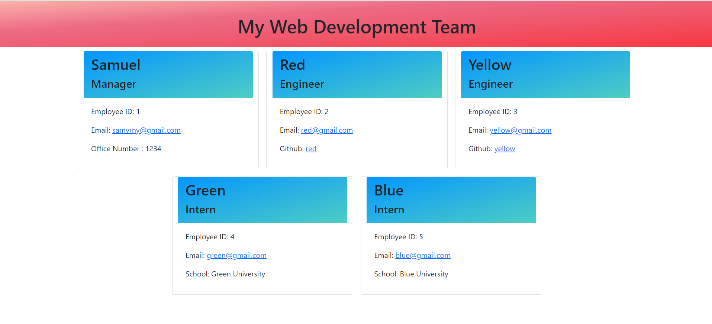

# Dev Team Profile Generator

## Description
This project is used to dynamically create a webpage with profiles of a web development team from the command line using nodejs. Look in the dist directory in the root directory of this project for a sample of the HTML the application generates.

## Installation
This project uses the "Jest" and "Inquirer" packages. Run nmp install from the command line to install the dependancies

## Usage
Run node index from the command line to invoke the application.

Here is a walkthrough video for the application:

Here is an example of the generated HTML:

## Made with
* Javascript
* Jest
* Inquirer 
* Bootstrap
* CSS
* HTML

## Contribution
Made by Samuel Varney